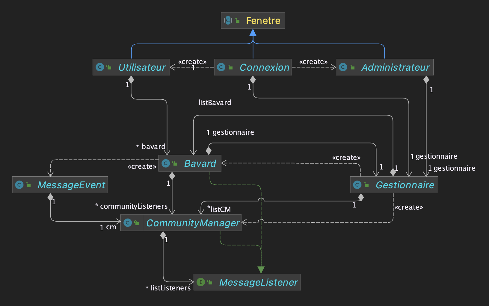
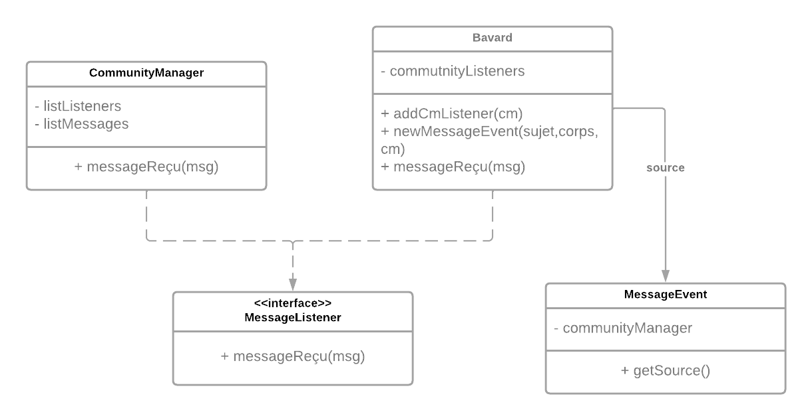
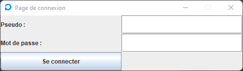
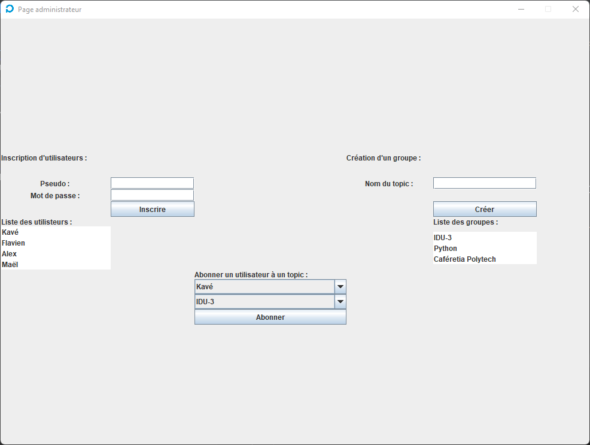
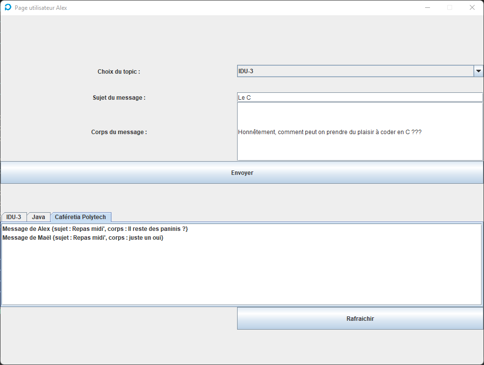

# INFO633 - Projet de Messagerie

Dans ce projet, nous allons créer une interface graphique en Java, permettant à plusieurs utilisateurs connectés en simultanés, de s'envoyer des messages dans différents topics.
Le but est d'avoir des bavards, qui peuvent envoyer des messages dans des topics, représentés chacun par des community manager. 
Lorsqu'un bavard envoie un message dans un topic qu'il choisit, c'est d'abord le community manager qui reçoit le message et qui le redistribue aux utilisateurs abonnés au topic.
Un gestionnaire permettra la création de bavards, de community manager, et l'abonnement des bavards à des topics.

## Diagramme UML

Pour illustrer le programme, voici un diagramme UML reprenant l'ensemble des classes et interfaces, leurs méthodes, ainsi que leurs lien d'héritage ou d'implémentation.

     
    <i>Diagramme UML du programme</i>

## Gestion des entités et des messages

Tout d'abord, il faut créer une structure qui permettra de gérer l'envoie et la réception de messages entre différents utilisateurs. Pour cela, nous allons utiliser un modèle à évènement. 
Cela consiste en une source, ici un utilisateur que l'on appellera Bavard, qui envoie un message à d'autres utilisateurs, donc d'autres objets de la classe Bavard. Le message est ainsi l'événement MessageEvent, il hérite alors de la classe EventObject.
Pour gérer l'envoie du message, celui-ci est d'abord envoyé à un objet de la classe CommunityManager (CM), qui servira de relais, pour l'envoyer à tous les utilisateurs abonnés au topic que le CommunityManager représente.
En effet, le CM possède une liste de MessageListener, qui sont des objets qui implémente l'interface MessageListener.
Cette dernière hérite de la classe EventListener, et contient la signature de la méthode permettant d'écouter l'événement message qui est reçu.
Ainsi les objets de la classe Bavard sont à la fois des sources, et écouteurs des événements MessageEvent.
Pour finir, on créé la classe Gestionnaire qui possède l'ensemble des objets Bavards et CommunityManager de la messagerie, grâce à des listes. Celle-ci sera instancié une seule fois, dès le lancement du programme. Elle possède ainsi toutes les méthodes permettant de gérer la création, suppression de Bavard/CM et l'abonnement aux topics.

     
    <i>Diagramme UML du modèle à événement de la messagerie</i>

## L'interface graphique et son lien avec la messagerie

Maintenant que la structure globale de la messagerie est faite, il ne reste plus qu'a créer une interface graphique.
Pour cela, nous créons une classe abstraite Fenetre qui utilise la classe JFrame pour afficher des éléments graphique. Ainsi nous utiliserons tous les éléments du package java.swing comme les JLabel, JButton, etc... 
Pour placer tous cela, nous utiliserons le GridBagLayout, qui permet de définir un nombre de colonnes et de lignes pour découper la page, en plusieurs zones.
Toutes les pages de l'interface hériterons ainsi de la classe Fenetre.
On aura en tout 3 fenêtres :
- Fenêtre de connexion
- Fenêtre utilisateur qui permet de voir les messages reçus et d'en envoyer
- Fenêtre de gestionnaire pour gérer le système

### Fenêtre de connexion
Dans cette page, on ajoute des zones de saisies de texte pour le login et le mot de passe. Lors de l'appui sur le bouton, on vérifie si les identifiants sont correctes et correspondent à des bavards existants. De plus, si le login et le mot de passe sont tous deux de valeur admin, alors on ouvre la page administrateur. Sinon, si les identifiants correspondent à un bavard, on ouvre la page utilisateur.
A noter que la page de connexion reste ouverte après la connexion d'un utilisateur ou du gestionnaire.

     
    <i>Diagramme UML du programme</i>

### Fenêtre du Gestionnaire
Une fois connecté à l'aide des identifiants admin, la page administrateur s'ouvre. Dans celle-ci, on retrouve de nombreux éléments pour la gestion : 

- Formulaire de création d'un Bavard
- Liste des Bavard
- Formulaire de création d'un CommunityManager
- Liste des CommunityManager
- Formulaire d'abonnement d'un Bavard à un topic/CM

     
    <i>Page du gestionnaire</i>

Toutes ces fonctionnalités sont utilisables et liées avec la structure définie dans la partie précédente. Le problème qui s'impose alors est la mise à jour en temps réel de l'interface graphique. Par exemple, lorsque l'on créé un nouveau Bavard, il faut que la liste des Bavard du gestionnaire soit actualisée. Pour cela, les JList que nous utilisons sont basés sur des DefaultListModel, qui sont elles mêmes basés sur les ArrayList définis dans la classe Gestionnaire. Ainsi, lorsqu'un nouvel objet est ajouté à l'ArrayList, la JList est automatiquement mise à jour avec le nouvel élément.

### Fenêtre utilisateur
La page utilisateur comporte deux éléments :
- Formulaire d'envoie d'un message
- Messagerie avec choix de topic

     
    <i>Page du gestionnaire</i>

Le formulaire comprend un une zone de saisie pour le sujet et le corps du message (JTextField), et un menu déroulant qui propose l'ensemble des topics auquel le Bavard est connecté (JComboBox). Puis, le bouton envoyer permet ainsi d'exécuter le processus d'envoie d'un message décrit précédemment.

Enfin, au bas de la page se trouve la messagerie. Celle-ci peut comporter un ou plusieurs onglets, en fonction du nombre de topics auquel le Bavard est abonné, grâce a des JTabbedPane. Ainsi, il existe un canal de messagerie pour chaque topic.
De la même façon que précédemment, la mise à jour de la messagerie qui est une JList de MessageEvent se fait à partir d'une DefaultListModel, basé sur l'ArrayList de MessageEvent du CommunityManager correspondant.
